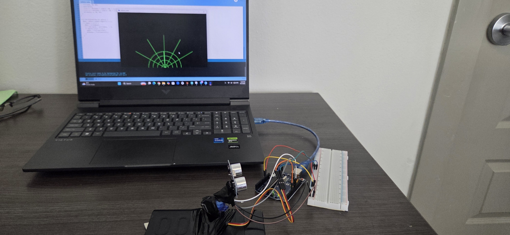
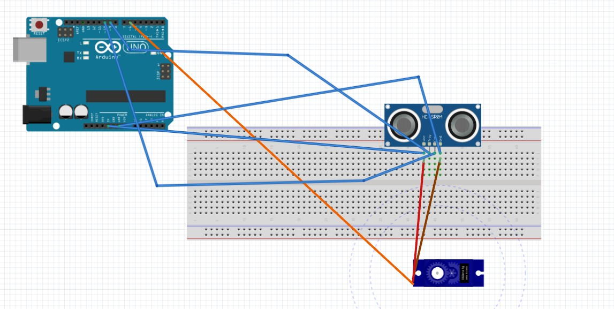
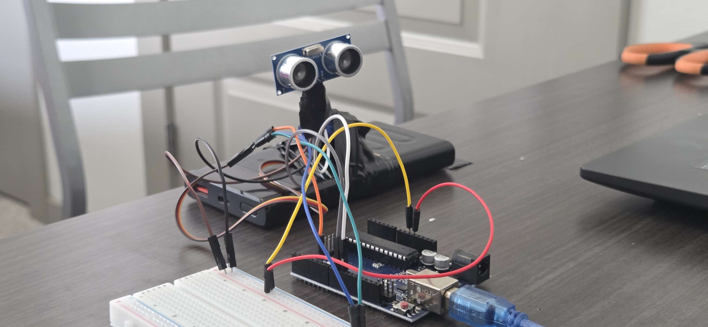
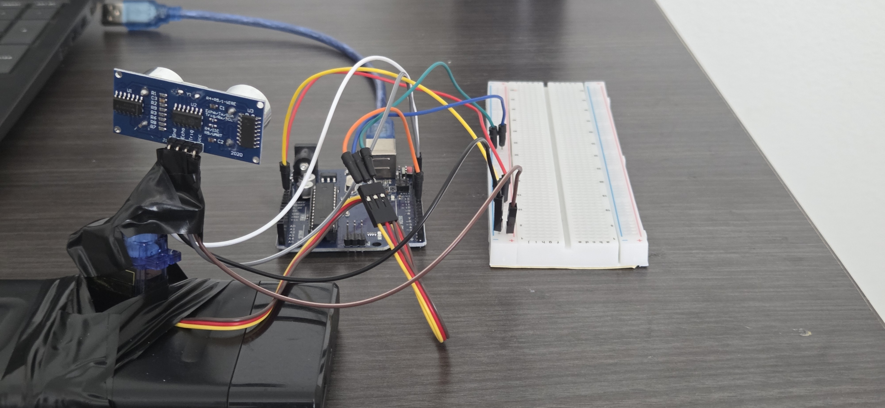
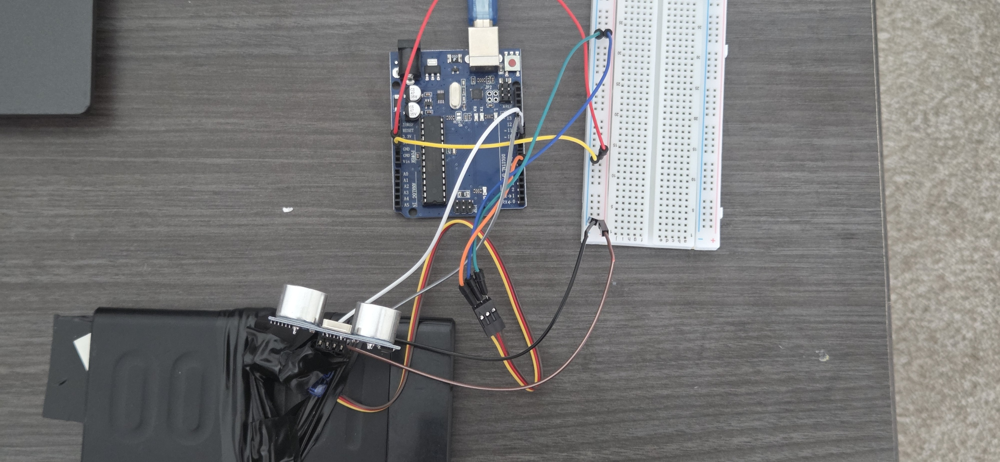

# Ultrasonic Radar System

A real-time radar system built with an Arduino Uno, HC-SR04 ultrasonic sensor,
and SG90 servo motor. The servo sweeps the sensor through a 150° arc while the
sensor measures distances at each angle. Data is streamed over serial to a
Processing sketch that renders a live radar visualization on screen with object
detection.

## Correction (September 2026)

The original version of this project had a mechanical flaw: the HC-SR04 was
never mounted on the servo horn. It sat in the breadboard while the servo
rotated beside it, so the sensor never changed direction. The angles in the
serial output came from the servo's commanded position, not from where the
sensor was actually pointing — every reading was taken looking the same way.

I found this while collecting data for a follow-up project. A flat panel
returned the same distance at every angle across the full sweep, which is
physically impossible for a rotating sensor. All data from the original build
was invalid, including the original demo video.

The build has been corrected: the sensor is now mounted on the servo horn, and
the sweep was verified against a known target at a fixed distance before
re-recording the demo. Three fixes went in alongside the mount:

- **`pulseIn` timeout.** The original call had no timeout, so a missing echo
  blocked for a full second. With five reads per angle, one no-echo angle could
  stall the sweep for five seconds — which only became visible once the sensor
  actually rotated and started pointing at open space.
- **No-echo handling.** `pulseIn` returns 0 on timeout, which the original code
  converted to a distance of 0 cm — an object against the sensor face. No-echo
  readings now return `-1`, and the Processing sketch skips them instead of
  drawing phantom blips.
- **Sweep narrowed to 15°–165°.** Keeps the sensor cable off the servo's hard
  stops, where repeated flexing concentrates.

## Demo

[Watch the demo video](REPLACE_WITH_NEW_YOUTUBE_LINK)

## Hardware

| Component | Purpose |
|-----------|---------|
| Arduino Uno | Microcontroller — runs sweep and sensor logic |
| HC-SR04 | Ultrasonic distance sensor (2cm–400cm range) |
| SG90 Servo | Rotates sensor through the sweep |
| Breadboard + jumper wires | Circuit connections |

## Wiring

*Electrical connections only. The sensor is mounted on the servo horn, not on
the breadboard — see the photos below.*

| HC-SR04 Pin | Arduino Pin |
|-------------|-------------|
| VCC | 5V |
| GND | GND |
| Trig | Pin 9 |
| Echo | Pin 10 |

| Servo Wire | Arduino Pin |
|------------|-------------|
| Signal (orange) | Pin 6 |
| Power (red) | 5V |
| Ground (brown) | GND |

The sensor is mounted on the servo horn and connected back to the breadboard
with female-to-male jumpers, with slack left in the bundle so rotation doesn't
pull on the sensor pins.

## How It Works

1. The servo sweeps from 15° to 165° in 1° increments, then back
2. At each angle, the HC-SR04 sends a 10μs ultrasonic pulse and measures echo return time
3. Distance is calculated: `distance = (echo_duration × 0.034) / 2`
4. A median filter takes 5 readings and returns the middle value to eliminate noise
5. Angles with no echo return `-1` rather than a distance
6. Angle and distance are transmitted over serial at 9600 baud
7. A Processing sketch reads the serial data and renders objects as blips on a radar display

## Setup

### Arduino

1. Clone this repo
2. Open `radar/radar.ino` in Arduino IDE
3. Install the `Servo` library via Sketch → Include Library → Manage Libraries
4. Select board: Tools → Board → Arduino Uno
5. Select port: Tools → Port → your COM port
6. Upload

### Processing

1. Download Processing at processing.org
2. Open `processing/radar_display/radar_display.pde`
3. Update the COM port on line 6 to match your port
4. Close the Arduino IDE's Serial Monitor — only one program can hold the port
5. Run — visualization appears when Arduino is connected and sending data

## Skills Demonstrated

- Embedded C++ firmware on Arduino
- Ultrasonic sensor interfacing (HC-SR04)
- PWM servo motor control
- Median filter implementation for sensor noise reduction
- Serial communication between microcontroller and PC
- Real-time data visualization in Processing
- Identifying and correcting an invalid measurement setup through data inspection

## Photos

