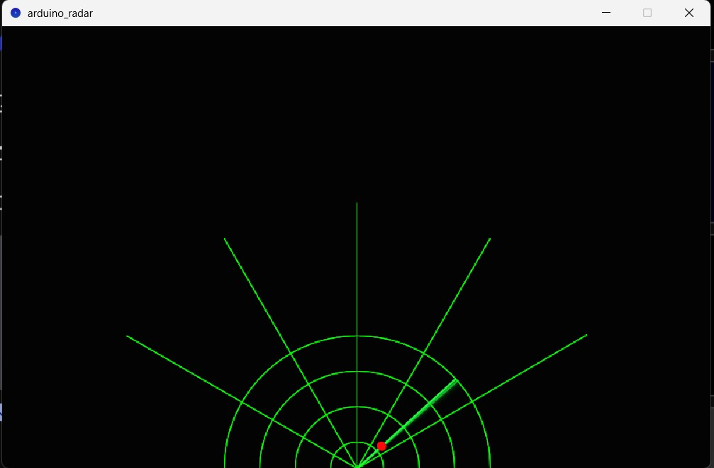
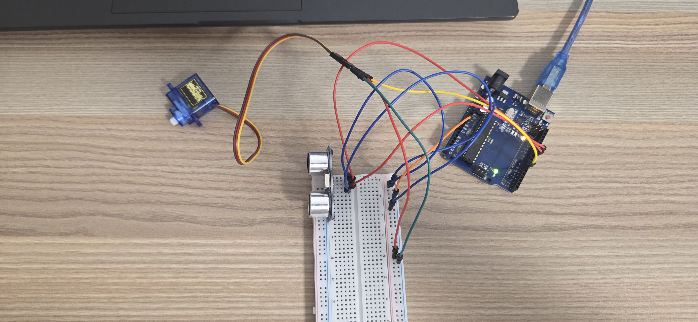
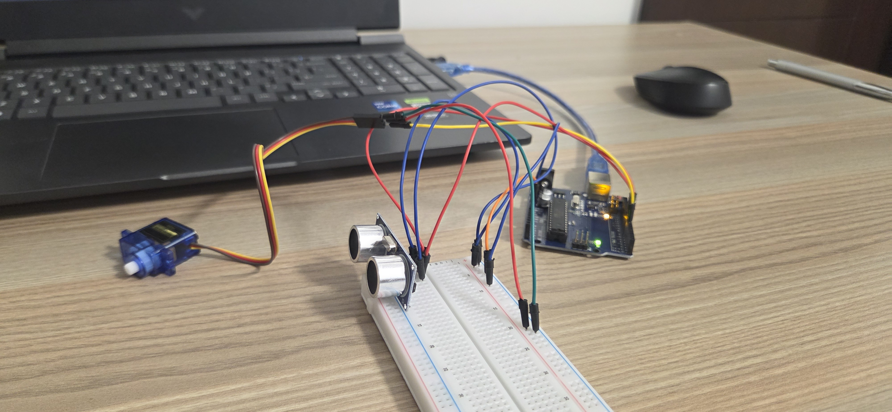
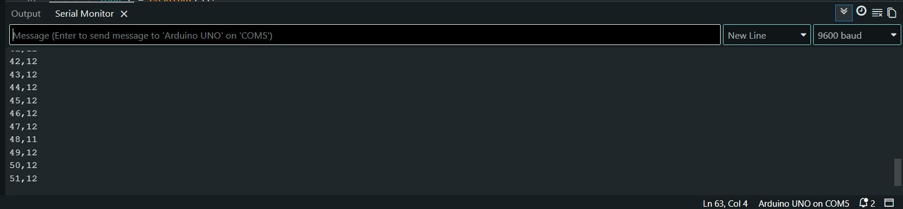

<<<<<<< HEAD
# Ultrasonic Radar System

A real-time radar system built with an Arduino Uno, HC-SR04 ultrasonic sensor,
and SG90 servo motor. The servo sweeps 180° while the sensor measures distances
at each angle. Data is streamed over serial to a Processing sketch that renders
a live radar visualization on screen with object detection.

## Demo

[Watch the demo video](https://youtu.be/jSA_84SK064)

## Hardware

| Component | Purpose |
|-----------|---------|
| Arduino Uno | Microcontroller — runs sweep and sensor logic |
| HC-SR04 | Ultrasonic distance sensor (2cm–400cm range) |
| SG90 Servo | Rotates sensor through 180° sweep |
| Breadboard + jumper wires | Circuit connections |

## Wiring

| HC-SR04 Pin | Arduino Pin |
|-------------|-------------|
| VCC | 5V |
| GND | GND |
| Trig | Pin 9 |
| Echo | Pin 10 |

| Servo Wire | Arduino Pin |
|------------|-------------|
| Signal (orange) | Pin 6 |
| Power (red) | 5V |
| Ground (brown) | GND |

## How It Works

1. The servo sweeps from 0° to 180° in 1° increments
2. At each angle, the HC-SR04 sends a 10μs ultrasonic pulse and measures echo return time
3. Distance is calculated: `distance = (echo_duration × 0.034) / 2`
4. A median filter takes 5 readings and returns the middle value to eliminate noise
5. Angle and distance are transmitted over serial at 9600 baud
6. A Processing sketch reads the serial data and renders objects as blips on a radar display

## Setup

### Arduino
1. Clone this repo
2. Open `radar/radar.ino` in Arduino IDE
3. Install the `Servo` library via Sketch → Include Library → Manage Libraries
4. Select board: Tools → Board → Arduino Uno
5. Select port: Tools → Port → your COM port
6. Upload

### Processing
1. Download Processing at processing.org
2. Open `processing/radar_display.pde`
3. Update the COM port on line 6 to match your port
4. Run — visualization appears when Arduino is connected and uploading data

## Skills Demonstrated

- Embedded C++ firmware on Arduino
- Ultrasonic sensor interfacing (HC-SR04)
- PWM servo motor control
- Median filter implementation for sensor noise reduction
- Serial communication between microcontroller and PC
- Real-time data visualization in Processing

## Photos

=======
# ultrasonic-radar-arduino
Ultrasonic radar system built with Arduino Uno, HC-SR04 sensor, and servo motor. Real-time radar visualization over serial communication.
>>>>>>> 86937f569c5871d37e4d4271fc939eff00256298
